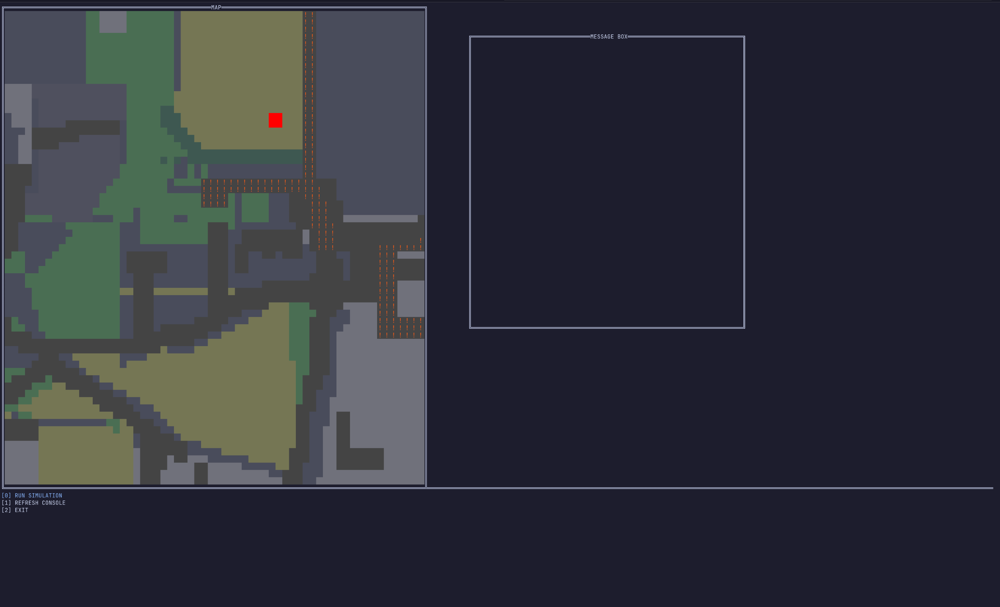

# Wildfire Road Safety
This project aims to assist in the creation of risk assesments during evacuation of people on roads in the event of an emerging wildfire.



## Installation & usage

### Dependencies
The program uses [libcurl](https://curl.se/libcurl/) as its only dependency.
On windows this dependency should be installed automatically by cmake when building the program,
but mac and linux machines should make sure the library is installed beforehand.

### Installation
To install the project on a local machine, download the repository by clicking on the green code button at the top of this repository page. This will show a menu where you can click on "Download ZIP". This will download the project to your desired location as a .zip file. Once the download has finished, unzip the file.
Alternativly, clone the github repo in the desired location:

```sh
$ git clone https://github.com/cs-25-sw-1-p1-12/wildfire-road-safety.git
```


Now that the project has been downloaded on your local machine and has been unzipped or cloned from the github repo,
you can go ahead and build the application with cmake:


```sh
$ mkdir build
$ cmake -B ./build
$ cmake --build ./build
```

Then the executable should be located in `./build/src/wfrs`.

Alternativly, if using an IDE like Clion, you can simply enter the project and run the program, then
the built application can be found in the directory `./cmake-build-debug/src/` under the name `wfrs`.


### Usage

To use the application when it is running, you will first be prompted to input a set of coordinates to form a bounding box confining the area you want to search for wildfires and create risk assessments for. This is done by first inputting the latitude of the first coordinate, then the longitude. The same will be required for the second coordinate once the first coordinate has been filled out.

After the information has been provided to the application, a TUI will appear that will consist of a map, a text field and a command field. Here, every road can be inspected simply by clicking on it. This will show the risk value of the road as well as some of the data used to calculate the risk value.

To exit the application, simply use the command field to exit the application.

## Contributing

### 1. Sign out an objective
Pick an objective card from the To Do List on the [JIRA board](https://p1gruppe12.atlassian.net/jira/core/projects/P1/board?filter=&groupBy=status). Transfer that card into the In Progress Task column, then add yourself to the objective by clicking on the card, then on Members (under "Add to card"), and then selecting yourself.

### 2. Create a GIT branch
#### In Git Bash
Create and checkout a new branch with the command `git checkout -b`. Name the branch with one of the following styles, depending on the "Type" field on your Objective card: `feature/branch-name` `bugfix/branch-name` `rework/branch-name`

### 3. Make your changes
Work as normal, writing and testing your code. Try to keep any changes within the scope of the Objective card(s) you have signed out.

### 4. Commit and Push changes
#### In Git Bash
Run the following commands in order:

- `git status` - This lets you review any changes you've made. Check this out to make sure you're not about to push changes you don't want to.
- `git add .` - 'Add' stages your files and prepares to commit them. Note: Using the . will stage all your changed files. If you don't want to do that, you can also add files individually with the following command: `git add file/name/here.c`
- `git commit -m` "Describe your changes here. This will commit the changes you've made so that you can push them to the public repo.
- `git push origin insert/branch-name` Replace 'insert/branch-name' with the name of your branch. E.g. `git push origin feature/basic-movement`

### 5. Create a Pull Request
Now your changes will be pushed to GitHub, but will not yet be merged with the master branch. When you're finished and think you're ready to merge your code with the master branch, you can submit a Pull Request. On the repository [main page](https://github.com/cs-25-sw-1-p1-12/wildfire-road-safety), switch from the 'master' branch to the one you just created.

From there, you can click "Pull Request", which lets you create a request to merge your new branch with the master branch. GitHub will tell if you if there are any merge conflicts. If there aren't, you can click 'Create Pull Request' to submit your PR.

Finally, let another member of the team know that you've submitted a PR so that they can review your code and accept the pull request or ask you to make changes.


## Authors

- Marcus Horsholt Hvingelby
- Emil Vilhelm Magnusen Bille
- Atle Skaanes Ahrenfeldt
- Andreas Boisen Jordansen
- Ahmad Tasnim Zirman

